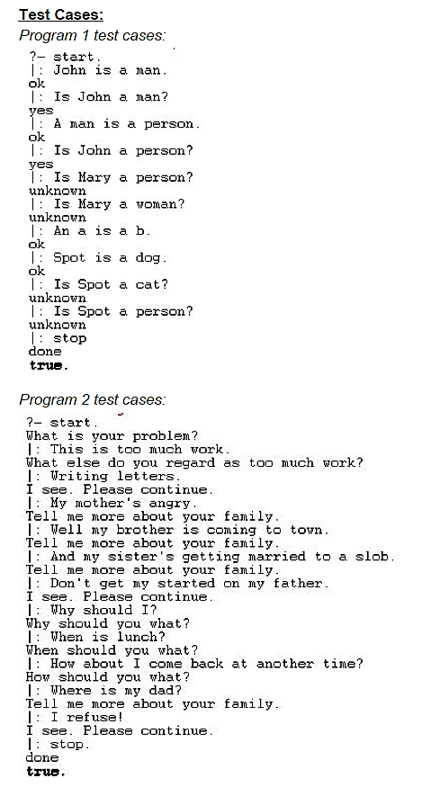

# Basic Chat Bot in Prolog
1. Project title
    * Basic Chat Bot in Prolog
2. Project Description
    * Program1 understands simple English sentences and gives an appropriate response (yes, no, ok, unknown), on the basis of the sentences
previously given. Program2 acts as a simulated psychiatrist that makes a reply based on key words in the input.
3. Author
    * John Stephenson
4. Screenshots/Sample Session
    * Test Cases
        *    
5. Contact Information
    * johnds39@uab.edu
